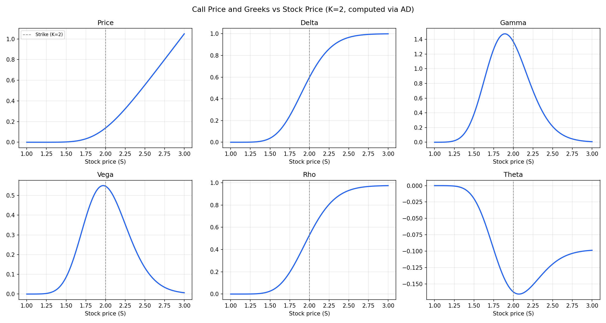
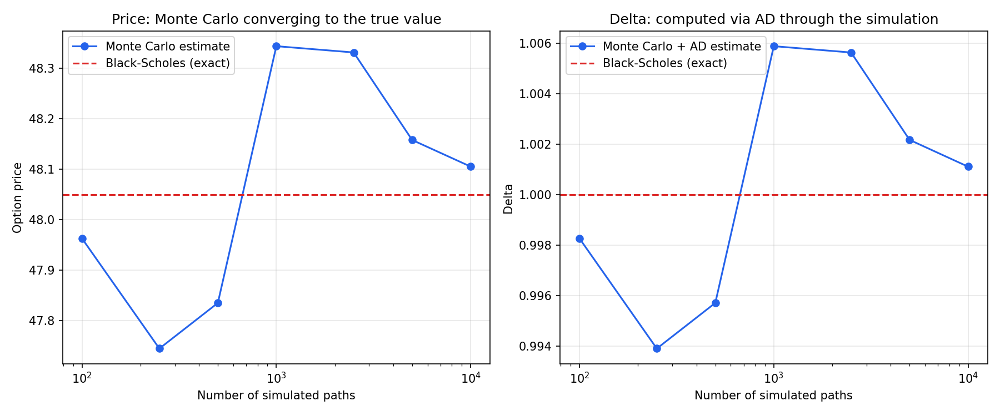

# mini-autodiff-cpp

An automatic differentiation (AD) engine built from scratch in C++ applied
to option pricing.

## Why this exists

Pricing an option is one calculation. Knowing how that price reacts to
changes in the stock price , volatility , interest rate , or time (the
"Greeks") is what risk management actually needs , and it's normally either
approximated by nudging inputs and re-running the whole pricer, or worked
out by hand for each new model. AD gets exact sensitivities directly from
the calculation itself , in one pass , for any number of inputs.

This project builds that technique from first principles: forward mode,
then reverse mode, then second-order , then applies it to real pricing
problems including a case with no closed-form answer to check against.

## Try it

\`\`\`bash
g++ -std=c++17 -O2 -I include src/interactive_pricer.cpp -o pricer
./pricer
\`\`\`

It asks for a stock price, strike, rate, volatility, and expiry, prices a
call and a put, prints every Greek, and writes two CSV files. Then:

\`\`\`bash
python plot_greeks.py
python plot_mc_convergence.py
\`\`\`

produces \`greeks_plot.png\` (price and all Greeks across a range of stock
prices) and \`mc_convergence_plot.png\` (how a Monte Carlo estimate settles
toward the true price as more paths are simulated).

## What's in here

| File | What it does |
|---|---|
| \`include/dual.hpp\` | Forward-mode AD (\`Dual\` numbers) |
| \`include/tape.hpp\`, \`include/var.hpp\` | Reverse-mode AD (\`Var\` numbers on a recorded tape) |
| \`include/tape2.hpp\`, \`include/var2.hpp\` | Generic version of the above, used for second-order AD |
| \`include/black_scholes.hpp\` | Call/put pricing, written with \`Var\` |
| \`include/black_scholes2.hpp\` | Same pricing formula, written generically |
| \`include/black_scholes_formulas.hpp\` | Closed-form Greeks, for validation only |
| \`src/main.cpp\` | Forward-mode demo |
| \`src/black_scholes_greeks.cpp\` | Call/put Greeks via reverse-mode AD |
| \`src/gamma_second_order.cpp\` | Exact Gamma via forward-over-reverse AD |
| \`src/monte_carlo_greeks.cpp\` | Greeks from a Monte Carlo simulation — no formula involved |
| \`src/interactive_pricer.cpp\` | Takes user input, prices, writes plot data |
| \`src/greeks_surface.cpp\`, \`src/mc_convergence.cpp\` | Data generation for the two charts |
| \`tests/test_black_scholes.cpp\` | Checks AD Greeks against formulas across 8 scenarios |

## Why Black-Scholes shows up so often

It's used as a validation case , not the actual point. Its Greeks are known
in closed form , so it's possible to check the AD engine got the right
answer. The Monte Carlo file is the one that shows the real use case:
getting exact-in-expectation sensitivities from a calculation that has no
formula to check against at all — which is the situation for most exotic
and path-dependent options in practice.

## Run the tests

\`\`\`bash
g++ -std=c++17 -I include tests/test_black_scholes.cpp -o test_bs
./test_bs
\`\`\`

## Inspiration

A simplified version of the idea behind
[XAD](https://github.com/auto-differentiation/xad), a production AD library
used in quantitative finance.